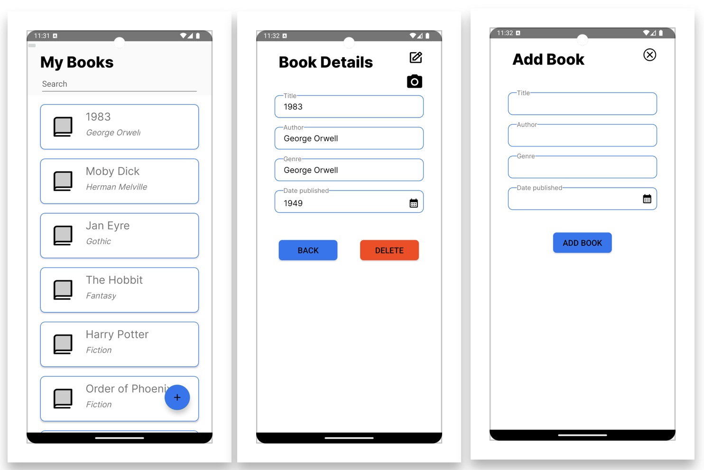

# Book Collection Manager: Android Mobile Application

Book Collection Manager is a mobile application designed to help users manage their personal book collections effortlessly. The application provides features to catalog books, search within the collection, track reading progress, and share recommendations with friends.

## Features

- **Cataloging Books**: Add new books to your collection by manually entering details or by scanning the ISBN.
- **Search and Filter**: Easily search and filter books in your collection by title, author, genre, or reading status.

## Technologies used
- **Firebase Real-time database**
- **Java**
- **Android Studio**
  

